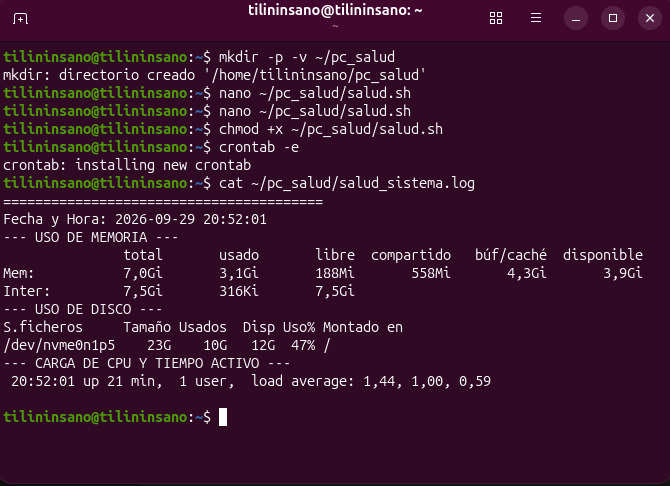
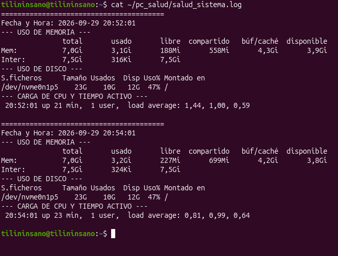
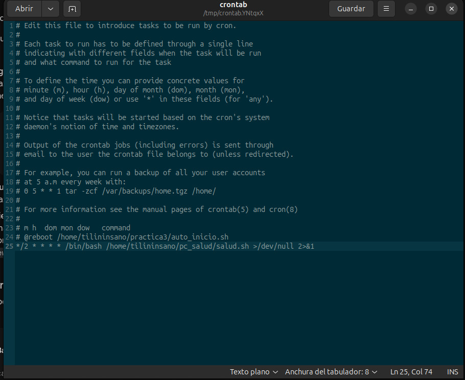

# Contenido del Proyecto

## 📁 Código y Scripts
*   **[codigos.sh](./Codigo%20y%20Scripts/codigos.sh)** — Script de Shell que contiene la lógica principal del servicio/demonio para la configuración e implementación en el sistema.

## 📁 Reporte
*   **[Reporte Practica Salud Sistema](./Reporte/Reporte_Practica_Salud_Sistema.pdf)** — Documento en formato PDF que detalla el desarrollo, la metodología y los resultados de la práctica sobre la monitorización de salud del sistema.

## 📁 Terminal
A continuación, se muestran las capturas de pantalla que documentan la ejecución de comandos y la verificación del servicio desde la terminal:

1.  **Captura de ejecución de comandos en la terminal (Paso 1).**
    

2.  **Captura de ejecución de comandos en la terminal (Paso 2).**
    

3.  **Captura de ejecución de comandos en la terminal (Paso 3).**
    

## 📁 Video
*   **[video.md](./Video/video.md)** — Archivo de documentación con el enlace externo y las instrucciones para visualizar la demostración en video del proyecto.
